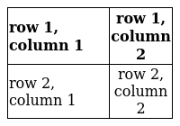

## This should become a (crappy) table

Text for test. Will ignore column width.

:::{.list-table widths=2,1}
- - row 1, column 1
  - row 1, column 2
- - row 2, column 1
  - row 2, column 2
:::

## This is what the output should look like eventually

Table with text as text. Some stuff in bold. Low res for the purpose of this example. Code used to create the image:

```bash
bash render_table.sh table.yaml table.png -a l,c -w 2,1 -W 200
```



## This should become an image

Table with text as text. Some stuff in bold.

```{.list-image widths=2,1 aligns=l,c width=200}
- - **row 1, column 1**
  - **row 1, column 2**
- - row 2, column 1
  - row 2, column 2
```
